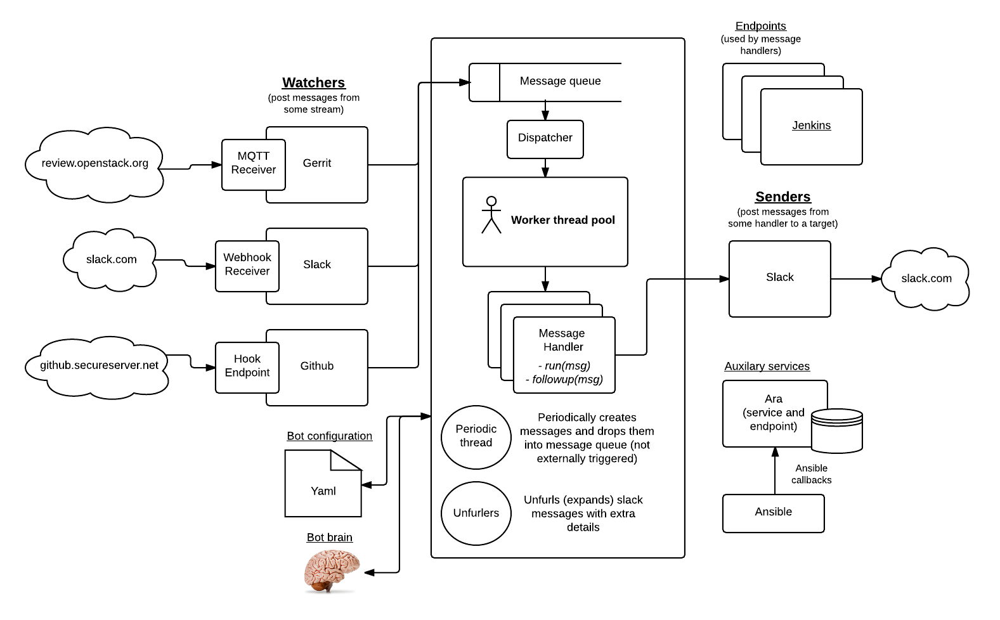

Goal
----

**TLDR**: *Make operations and developers lives less
hands-on and more hands-off.*

My **overall** goal in life is that the work that I can perform would
make the day to day task of doing various operations streamlined (I also
enable the automation of any other repeated tasks in a simple to code
manner) and enable humans on the cloud team(s) to engage in higher level
activities (and letting the low level and typically repetitive activities be
handled and orchestrated by myself).

Abilities (real and desired)
****************************

-  End to end openstack deployments (with **cancellation** abilities).
-  End to end openstack environment creation (with **cancellation**
   abilities).
-  **Arbitrary** jenkins job triggering and job completion and progress
   tracking (with **cancellation** abilities).
-  Various/miscellaneous periodic activities (such as weekly upstream
   repository syncs).
-  Orchestration of complicated github interactions (by being a github
   repository hook endpoint).

   -  *For example:* this allows me to start a build when a specific github
      comment has been added or close a pull request automatically on
      repositories the group does not want modified and more!

-  Gerrit (primarily http://review.openstack.org) stream notifications.

   -  *For example:* this allows me to notify human (or other) users of
      relevant upstream changes being made or it makes it possible to
      kick off daily or hourly (per-merge would require a large
      infrastructure) builds using some specific sha of what was committed
      into various projects.

-  Ansible execution & orchestration and runtime recording using `ara`_
   (with **cancellation** abilities).

   -  *For example:* this allows me to initiate complex ansible workflows, and
      ensure that they are recorded and logged in a **single** central place
      for others to view as needed (ie for debugging or failure analysis).

-  And much more!

I am also:

-  Fully **slack** integrated (to make myself **easy** to interact with).
-  Fully **local host + password** telnet integrated (for when
   slack is down).
-  Fully **github** integrated (so I can receive github merge events and more).
-  Fully **gerrit** integrated (so I can receive gerrit events and more).
-  Easily pluggable, configurable and extendable.
-  Great at what I do.
-  Written in python.
-  And much more!

Architecture
------------

Development
-----------

See: DEVELOP.rst

.. _ara: https://ara.readthedocs.io
